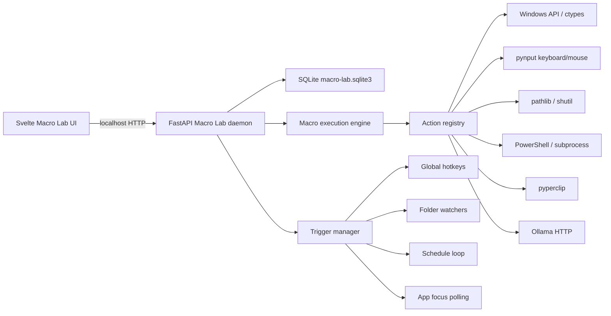

# Macro Lab Architecture

Date: 2026-06-16

Macro Lab is a private Windows automation control center. It is built as a local-only FastAPI
daemon plus a Svelte control-center page in the Mini Hub. The daemon owns all privileged
desktop operations; the browser UI only edits definitions, starts/stops triggers, and requests
runs.

## Assumptions

- This is for one technical Windows user on a trusted desktop.
- The service is bound to `127.0.0.1` by default and should not be exposed on the LAN.
- Python is the right substrate because Windows automation libraries, file watchers, shell
  orchestration, and Ollama calls are all easy to compose there.
- Dangerous actions must be explicitly armed or run with a one-shot confirmation request.
- Dry-run should be available for every action, even when the exact OS side effect cannot be
  perfectly simulated.

## Architecture



## Data Model

Macros are JSON records stored in SQLite:

```json
{
  "id": "macro_study_mode",
  "name": "Study Mode",
  "group": "Workspaces",
  "enabled": true,
  "armed": false,
  "dry_run_default": true,
  "variables": { "course": "CS" },
  "actions": [
    { "id": "open_notes", "type": "app.launch", "config": { "target": "notepad.exe" } }
  ],
  "triggers": [
    { "id": "hotkey", "type": "hotkey", "enabled": false, "config": { "keys": "<ctrl>+<alt>+s" } }
  ]
}
```

The database also stores:

- `run_history`: macro run status, dry-run flag, step results, errors, timestamps.
- `clipboard_history`: recent clipboard text snapshots.
- `window_layouts`: captured window title/process/geometry records.
- `modes`: named workspace recipes that can launch apps/URLs and restore layouts.
- `settings`: panic state and service-level toggles.

## Action Interface

Each action handler exposes:

- `type`: stable action ID, such as `shell.run` or `window.restore_layout`.
- `safety`: `safe`, `input`, `destructive`, or `system`.
- `execute(context, action)`: performs the action or returns the dry-run plan.

Implemented action families:

- Input: `input.playback`, `input.hotkey`, `input.type_text`, `clipboard.paste_text`.
- Windows/workspaces: `app.launch`, `app.focus`, `app.close`, `window.save_layout`,
  `window.restore_layout`, `workspace.mode`.
- App orchestration: launch/focus/close windows, send keystrokes to the focused window,
  and run shell commands.
- Files: `file.batch_rename`, `file.move`, `file.copy`, `file.delete`.
- Clipboard: `clipboard.set`, `clipboard.transform`, clipboard history polling.
- Local AI: `ollama.transform_clipboard` to send selected text or clipboard text to Ollama
  and paste the result back.

## Trigger Interface

Triggers all call the same engine path:

- `hotkey`: global hotkey using `pynput.keyboard.GlobalHotKeys`.
- `schedule`: interval or daily `HH:MM` local-time schedule.
- `folder`: file-created events via `watchdog`.
- `app_focus`: active-window title/process polling.

Adding a trigger means implementing a runtime adapter that subscribes to events and calls
`engine.run_macro(macro_id, trigger_id=...)`.

## Safety Model

- The global panic state stops running macros, disables trigger execution, and can be activated
  through the UI, API, or a panic hotkey.
- `dry_run=true` returns action plans without side effects.
- Actions marked `input`, `system`, or `destructive` require either:
  - macro `armed=true`, or
  - one-shot API `confirm=true`.
- File deletion and process/window close are always considered destructive/system-level.
- The default seed macros are disabled or dry-run-first.

## Storage And Loading

On startup:

1. SQLite schema is created or migrated.
2. Default macros are seeded if the database is empty.
3. The trigger manager loads enabled macros and starts only enabled triggers.
4. Clipboard history polling starts if `pyperclip` is available.
5. Panic hotkey is registered if global hotkeys are available.

Macros can be edited in the UI as structured JSON. This is intentionally power-user friendly:
the schema stays simple, diffable, and easy to version.

## Extensibility

To add an action:

1. Create a handler in `macro_lab/actions.py`.
2. Register it in `build_action_registry()`.
3. Document the expected config shape.
4. Add a focused test for dry-run and validation behavior.

To add a trigger:

1. Create a runtime adapter in `macro_lab/triggers.py`.
2. Register it in `TriggerManager.rebuild()`.
3. Make sure it respects enabled state and global panic.
4. Add a route/UI affordance only after the runtime behavior works.

## Right-Sized Limits

This is an in-process daemon for a single desktop. It deliberately avoids queues, services,
cloud sync, or distributed workers. If a macro becomes important enough to need crash-resume,
the next step is SQLite-backed action checkpoints, not Kubernetes-shaped theater.
