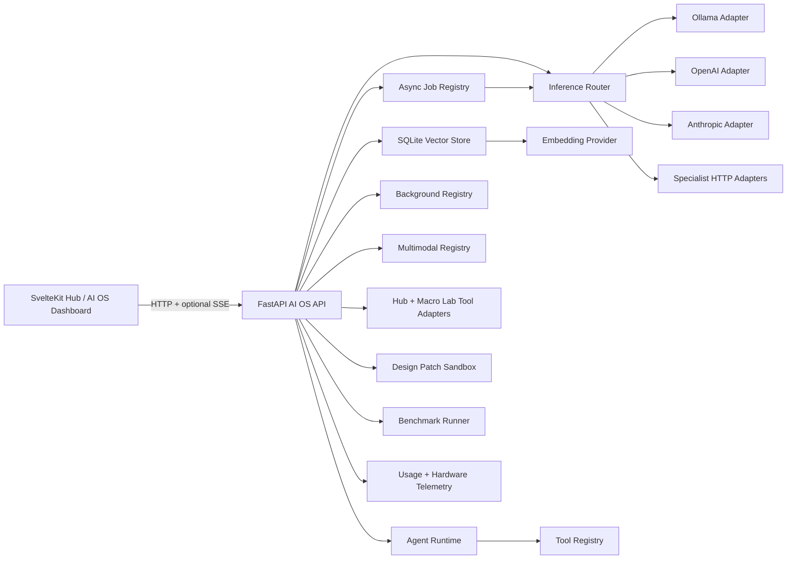

# Personal AI OS Capability Architecture

Date: 2026-06-16

## Goal

This layer is capability infrastructure, not a set of pre-selected AI features. It gives the
hub a local-first inference plane, queueable high-volume jobs, background triggers, agent
execution, semantic memory, app-control tools, reversible app design patches, multimodal
adapters, and hardware benchmarks that can be toggled or invoked later by specific workflows.

The implementation is a sibling FastAPI service at `apps/ai-os-api`. It is intentionally
separate from the existing Hono sync API because model IO, file ingestion, long-running jobs,
GPU telemetry, and local process health checks have different scaling and failure modes than
the personal data sync service.

## External API References

- Ollama serves its local API at `http://localhost:11434/api` by default and exposes chat,
  generation, model listing, and embedding endpoints:
  https://docs.ollama.com/api/introduction and https://github.com/ollama/ollama/blob/main/docs/api.md
- FastAPI streams long responses with `StreamingResponse`, which fits SSE-style token output:
  https://fastapi.tiangolo.com/advanced/custom-response/
- OpenAI's current API reference exposes Responses, Chat Completions, Images, Audio, and
  streaming surfaces: https://developers.openai.com/api/reference/overview/
- Anthropic's Messages API supports streaming responses with server-sent events:
  https://platform.claude.com/docs/en/build-with-claude/streaming

## Service Boundary

The service keeps local state in `AI_OS_DATA_DIR` using SQLite:

- `usage_log`: per-call provider, model, task, token estimate, cost estimate, latency, fallback chain.
- `memory_documents`, `memory_chunks`: text chunks, metadata, embedding vectors, source IDs.
- `job_events`: append-only job status/progress events for debugability.
- `tool_call_log`: every app tool invocation, confirmation block, result, error, and latency.
- `design_patches`: proposed/applied/reverted git patches with target files and safety metadata.
- `generation_assets`: prompt history and persisted local image/audio outputs when available.
- `benchmark_runs`: hardware snapshots, latency, provider/model, and result payloads for capability tests.

This database is not the personal cloud sync source of truth. It is the local AI operating
state and can be rebuilt or moved independently.

## Core Abstractions

### Provider Adapter

`ProviderAdapter` is the interface for text/chat inference providers. Every adapter exposes:

- `status()` for reachability, model inventory, and degradation reason.
- `complete(request)` for non-streamed calls.
- `stream(request)` for token/chunk streaming.
- Optional `embed(texts, model)` for local or API embeddings.

Adapters are registered by ID (`ollama`, `openai`, `anthropic`, `specialist:<name>`). The
router can choose by explicit provider, task type, local-first preference, cost ceiling, or
fallback policy. Adding another provider is a new adapter class plus one registration line.

### Capability

Capabilities are discoverable service surfaces, not workflows:

- `text.inference`
- `text.streaming`
- `jobs.batch`
- `jobs.self_consistency`
- `jobs.chunk_summarize`
- `ambient.triggers`
- `agents.plan_act_check`
- `memory.semantic_search`
- `multimodal.image`
- `multimodal.audio_tts`
- `multimodal.audio_stt`
- `multimodal.vision`

Each capability reports availability, adapter IDs, safety level, and whether it is enabled.
Ambient or destructive units default to disabled.

### Job Primitive

High-volume work is represented as a `JobSpec` with a primitive:

- `map`: run the same prompt template over a collection.
- `self_consistency`: run N completions and aggregate the raw candidates.
- `chunk_summarize`: chunk text, summarize each chunk, then summarize the summaries.
- `retry_loop`: retry a prompt until success or attempt budget is exhausted.

Jobs run in an in-process asyncio registry for v1. The interface isolates scheduling so a later
Redis, SQLite-backed, or desktop worker queue can replace it without changing callers.

### Background Unit

Ambient work is a registered unit with:

- `trigger`: `schedule`, `folder_watch`, or `app_event`.
- `enabled`: defaults to `false`.
- `destructive`: marks units requiring explicit confirmation before enabling.
- `run(payload)`: starts a job or calls a service.

The shipped units are placeholders that prove the plumbing and can be replaced. They are named
as demos and remain off by default.

### Agent Runtime

The agent engine is a generic plan-act-check-retry loop:

1. Ask a provider for a plan.
2. Execute declared tool calls through the local tool registry.
3. Check the result with another provider call.
4. Retry or hand off to a named agent until budget is exhausted.

Tools are real functions exposed by the AI OS service. Current tools include routed inference,
semantic memory search, Hub status, Study Desk session creation, Career Desk job creation,
Macro Lab macro listing, and Macro Lab macro execution. Tools declare `read`, `write`, or
`destructive` safety. Write/destructive tools require `confirm_actions=true`; otherwise the
tool call is logged as blocked and the model receives a confirmation-needed observation.

The command bar at `POST /api/ai/command` is a thin natural-language wrapper around this
agent runtime. It does not get special privileges. It uses the same registry, confirmation
rules, and logs as `POST /api/ai/agents/run`.

### Design Patch

AI-assisted app modification is intentionally patch-based:

- `POST /api/ai/design/patches` creates a stored unified diff from either supplied patch text
  or a provider-generated proposal.
- `POST /api/ai/design/patches/{id}/apply` runs `git apply --check` and then `git apply`.
- `POST /api/ai/design/patches/{id}/revert` runs `git apply -R`.
- Both apply and revert require `confirm=true`.
- Patch paths must be relative, stay inside `AI_OS_DESIGN_WORKSPACE_ROOT`, and match allowed
  extensions.

This keeps self-modification reversible and inspectable. The model proposes changes; the system
stores and applies patches through git mechanics rather than letting the model directly write
arbitrary files.

### Ingestion Source

Semantic memory is source-agnostic. A source only needs to emit:

- `source_type`
- `source_id`
- `text`
- optional metadata

The service chunks text, embeds it through the selected embedding provider, stores vectors in
SQLite, and exposes semantic query as a reusable service. PDFs, notes, chats, code, or Drive
exports can each become ingestion adapters later.

### Multimodal Adapter

Multimodal providers share a simple request/response envelope:

- `image.generate`
- `audio.tts`
- `audio.stt`
- `vision.describe`

Implemented adapters:

- OpenAI image, TTS, STT, and text/vision-compatible request path when API keys are configured.
- Ollama vision through `/api/generate` with image payloads.
- ComfyUI image generation when `COMFYUI_BASE_URL` plus a workflow are configured.
- Piper local TTS when `PIPER_EXECUTABLE` and `PIPER_VOICE_PATH` are configured.
- Whisper CLI local STT when `WHISPER_EXECUTABLE` is configured.

Outputs are recorded in `generation_assets`; binary image/audio results are copied under
`AI_OS_ASSETS_DIR/generations`.

### Benchmark

Benchmarks are first-class records, not just UI timers. `POST /api/ai/benchmarks` captures
hardware before/after, provider/model, latency, tokens/sec when available, and the raw result.
Text benchmarks route through the inference router; image benchmarks route through the
multimodal image adapter.

## Queueing, Streaming, And Long-Running Work

- Short calls use `POST /api/ai/infer`.
- Streaming calls use `POST /api/ai/infer/stream` and emit SSE `message`, `error`, and `done`
  events.
- Long-running calls use `POST /api/ai/jobs`; the response is a job ID.
- Progress is pulled with `GET /api/ai/jobs/{job_id}` and results with
  `GET /api/ai/jobs/{job_id}/results`.
- Cancellation is cooperative through `POST /api/ai/jobs/{job_id}/cancel`.

The router records usage/cost/latency whether the call succeeds, falls back, or fails. Local
Ollama calls estimate cost as zero. Paid adapters estimate cost from configurable per-1M-token
rates so cost controls can exist without hardcoding pricing claims.

## Optionality And Safety

- Local Ollama is preferred when available.
- Paid API providers are disabled until API keys are configured.
- Specialist providers are loaded only from `AI_OS_SPECIALIST_PROVIDERS_JSON`.
- Ambient units are registered but off by default.
- Destructive agent tools are not included by default.
- Missing GPU, Ollama, API keys, models, or optional binaries produce degraded status objects
  rather than crashing the dashboard.
- Provider fallback is explicit in each request and recorded in usage logs.

## Public API Surface

- `GET /api/ai/health`
- `GET /api/ai/status`
- `GET /api/ai/capabilities`
- `GET /api/ai/providers`
- `GET /api/ai/tool-calls`
- `POST /api/ai/command`
- `POST /api/ai/infer`
- `POST /api/ai/infer/stream`
- `GET /api/ai/usage`
- `POST /api/ai/jobs`
- `GET /api/ai/jobs`
- `GET /api/ai/jobs/{job_id}`
- `GET /api/ai/jobs/{job_id}/results`
- `POST /api/ai/jobs/{job_id}/cancel`
- `GET /api/ai/background/units`
- `POST /api/ai/background/units/{unit_id}/toggle`
- `POST /api/ai/background/units/{unit_id}/run`
- `POST /api/ai/agents/run`
- `POST /api/ai/memory/ingest`
- `POST /api/ai/memory/query`
- `POST /api/ai/multimodal/{kind}/invoke`
- `GET /api/ai/generation-assets`
- `GET /api/ai/design/patches`
- `POST /api/ai/design/patches`
- `POST /api/ai/design/patches/{patch_id}/apply`
- `POST /api/ai/design/patches/{patch_id}/revert`
- `GET /api/ai/benchmarks`
- `POST /api/ai/benchmarks`

## UI Surface

The Svelte route `/ai-os` is a capability dashboard. It shows provider reachability, hardware
utilization, capabilities, usage logs, queue state, command/tool execution, patch history,
background units, semantic memory, agents, multimodal test fire controls, generation history,
and benchmark runs. It is not a feature chooser. It is a cockpit for seeing what the AI
substrate can do before deciding what to build with it.

## Assumptions

- The existing Ollama service can be reached at `OLLAMA_BASE_URL`, defaulting to
  `http://127.0.0.1:11434`.
- The repository did not contain a committed FastAPI app, so this change creates one beside the
  existing Svelte/Hono/Tauri workspaces.
- The dashboard is allowed to talk directly to the FastAPI AI OS API at `PUBLIC_AI_OS_API_URL`.
- API costs are estimates supplied by config, not authoritative billing records.
- This is single-user private infrastructure. Multi-user authorization can be added at the
  FastAPI edge later if the service is exposed beyond localhost or Tauri.
